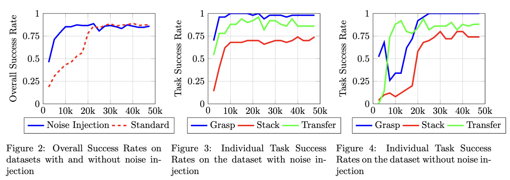

# Integrating Natural Language Instructions into the Action Chunking Transformer for Multi-Task Robotic Manipulation

## [Download Paper](https://kevinrohling.com/nl-act.pdf)

**Note**: This repository is a fork of the original [ACT repository](https://github.com/tonyzhaozh/act) by Tony Z. Zhao. The original repository contains the implementation of the Action Chunking Transformer (ACT) model for robotic manipulation. This fork extends the ACT model to support multi-task robotic manipulation based on natural language instructions. The code and scripts in this repository are used to generate instruction embeddings, record multi-task episodes, train the ACT model, and evaluate the model on unseen instructions.


---

### Abstract

We address the challenge of enabling robots to perform multiple manipulation tasks based on natural language
instructions by integrating text embeddings into the Action Chunking Transformer (ACT) model developed by
Zhao et al. [2023]. Specifically, we modify the ACT architecture to accept embeddings of task instructions
generated using the all-mpnet-base-v2 [Song et al., 2020] model, and integrate them into the transformer [Vaswani
et al., 2023] encoder’s input. To introduce generalization across task instruction phrasings, we generate a diverse
set of paraphrased instructions for each task using GPT-4o [OpenAI et al., 2024] and use random instruction
sampling during training to prevent overfitting trajectories to specific instructions.
Our experiments, conducted in a simulated Mujoco [Todorov et al., 2012] environment with a bimanual ViperX
robot, focus on three tasks: object grasping, stacking, and transfer. We collect two datasets composed of 50
episodes per task with randomized object placements, one with noise applied to trajectories during data collection
[Tangkaratt et al., 2021] and one without noise. For each task we use 25 task instruction phrasings during training
and hold out 10 for evaluation to assess generalization. The modified ACT model achieves an overall success rate
of 89.3% across the three tasks, demonstrating the ability to map unseen task instructions to robotic control
sequences.

---

### Results

For details on the experiments, results, and analysis, please refer to the paper.

| Dataset                  | Training Iteration | Overall (%) | Grasping (%) | Stacking (%) | Transfer (%) |
|--------------------------|--------------------|-------------|--------------|--------------|--------------|
| With Noise Injection     | 22500             | 88.7        | 100.0        | 70.0         | 96.0         |
| Without Noise Injection  | 40000             | 89.3        | 100.0        | 80.0         | 88.0         |



---

### Repository Overview

This repository contains code for extending the [Action Chunking Transformer (ACT)](https://arxiv.org/abs/2304.13705) to enable multi-task robotic manipulation based on **natural language instructions**. We integrate text embeddings into the ACT architecture, allowing robots to execute tasks in response to natural language instructions.

The main scripts are as follows:
- `generate_instruction_embeddings.py`: Converts raw text instructions into sentence embeddings and saves them to train/val CSV files for use in training.
- `record_multi_task_episodes.py`: Records episodes for each task type (grasp, stack, transfer) and saves them to an HDF5 dataset. 
- `train.py`: Trains the ACT model on the specified multi-task episodes and instruction embeddings.
- `eval_checkpoint.py`: Evaluates a trained checkpoint on a given instruction or CSV file with instruction embeddings.

If a Weights & Biases API Key is supplied all results will be logged and uploaded there. Note that the easiest way to use this repository is with the pre-built Docker container on DockerHub.

---

### Docker Container

This project provides a Docker container, hosted on [DockerHub](https://hub.docker.com/repository/docker/krohling/nl-act/general), that includes the simulation environment, training scripts, datasets, and all other dependencies needed to reproduce the results. It will automatically download the pre-generated datasets stored on HuggingFace for training and is especially convenient for running on GPU-based cloud services such as [RunPod.io](https://www.runpod.io). The Docker image is pre-built for the `amd64` architecture and will not run on Apple Silicon environments natively. You really want a GPU environment for training anyway.

#### Using the Pre-Built Docker Image

1. **Pull the Docker Image**:
    ```bash
    docker pull krohling/nl-act
    ```

2. **Run the Docker Container**:
    The container includes all necessary dependencies (MuJoCo, dm_control, PyTorch, etc.). You can run it with the default configurations or set environment variables for more control. Here’s an example run command that also mounts a local output directory and sets a few environment variables:

    ```bash
    docker run -it \
        --gpus all \
        -v $(pwd)/output:/opt/ml/output \
        -e WANDB_PROJECT="my_wandb_project" \
        -e WANDB_ENTITY="my_wandb_entity" \
        -e WANDB_API_KEY="my_wandb_api_key" \
        krohling/nl-act
    ```

    Replace `my_wandb_project`, `my_wandb_entity`, and `my_wandb_api_key` with your actual Weights & Biases credentials if you wish to log and visualize your training metrics.

#### Building the Docker Image Locally

If you prefer to build the Docker image locally (for example, to tweak dependencies), you can use the provided `Dockerfile`:

1. **Build the Image**:
    ```bash
    docker build -t nl-act .
    ```

2. **Run the Image**:
    ```bash
    docker run -it \
        --gpus all \
        -v $(pwd)/output:/opt/ml/output \
        -e WANDB_PROJECT="my_wandb_project" \
        -e WANDB_ENTITY="my_wandb_entity" \
        -e WANDB_API_KEY="my_wandb_api_key" \
        nl-act
    ```

#### Environment Variables

Below is a list of environment variables recognized by the Docker container (and used by the `train.py` script). Most of these have defaults, so you can override them as needed. **Note**: While the container will execute without customizing any of these variables, it is highly recommended to modify the batch size to fit your environment.

| **Variable**         | **Default**          | **Description**                                                 |
|----------------------|----------------------|----------------------------------------------------------|
| `LR`                 | `1e-5`               | Learning rate.                                                                         |
| `BATCH_SIZE`         | `1`                  | Batch size used for both training and validation.                                      |
| `NUM_EPOCHS`         | `30000`              | Number of epochs (training iterations) to run.                                         |
| `DATASET_DIR`        | `./dataset`          | Path to the directory containing the .hdf5 training dataset.                           |
| `TRAIN_INSTR_PATH`   | `./data/instruction_embeddings.train.csv` | CSV with training instruction embeddings.                             |
| `VAL_INSTR_PATH`     | `./data/instruction_embeddings.val.csv`   | CSV with validation instruction embeddings.                           |
| `CKPT_DIR`           | `./output/checkpoints` | Directory to save model checkpoints.                                  |
| `CKPT_FREQUENCY`     | `2500`               | Save model checkpoints every N epochs.                                                 |
| `LOAD_CKPT_PATH`     | *None*              | If specified, continue training from this checkpoint.                                  |
| `SEED`               | `0`                  | Random seed for reproducibility.                                                       |
| `EVAL`               | `False`             | Whether to evaluate the model during training.                                         |
| `EVAL_INSTR_PATH`    | `./data/instruction_embeddings.val.csv` | CSV for evaluation instruction embeddings.                            |
| `EVAL_FREQUENCY`     | `2500`               | Run evaluation every N epochs (only if `--eval` is true).                              |
| `EVAL_WAIT`          | `0`                  | How many epochs to wait before starting evaluations.                                  |
| `NUM_ROLLOUTS`       | `10`                 | Number of rollouts to perform for each evaluation block.                               |
| `VIDEOS_DIR`         | `./output/videos`    | Path to store rendered rollout videos (if any).                                        |
| `ONSCREEN_RENDER`    | `False`             | Whether to render the environment onscreen during evaluation.                         |
| `TEMPORAL_AGG`       | `False`             | Enable or disable temporal aggregation at inference.                                   |
| `CHUNK_SIZE`         | `100`                | Number of queries used in the action chunking process.                                 |
| `KL_WEIGHT`          | `10`                 | KL divergence weight factor in training.                                               |
| `HIDDEN_DIM`         | `512`                | Hidden dimension size in the transformer.                                              |
| `DIM_FEEDFORWARD`    | `3200`               | Dimensionality of the feedforward layers in the transformer.                           |
| `STATE_DIM`          | `14`                 | Dimensionality of the robot state representation.                                      |
| `LR_BACKBONE`        | `1e-5`               | Learning rate for the vision backbone.                                                |
| `BACKBONE`           | `resnet18`           | Vision backbone to use (e.g., `resnet18`).                                            |
| `ENC_LAYERS`         | `4`                  | Number of transformer encoder layers.                                                 |
| `DEC_LAYERS`         | `7`                  | Number of transformer decoder layers.                                                 |
| `NHEADS`             | `8`                  | Number of attention heads in the transformer.                                         |

Adjusting these variables allows you to customize data paths, training hyperparameters, and evaluation settings without modifying the scripts.  
If you have Weights & Biases credentials, set `WANDB_PROJECT`, `WANDB_ENTITY`, and `WANDB_API_KEY` to log and track training metrics.

---

**Tip:** When running on a headless server (e.g., HPC or a cloud GPU instance), make sure to omit `--onscreen_render`, since it requires a graphical interface.

---

### Local Environment

To set up a local environment:

1. Clone this repository:
   ```bash
   git clone https://github.com/krohling/nl-act.git
   cd nl-act
   ```

2. Create a Conda Environment and install dependencies:
    ```bash
    conda create -n nl-act python=3.10
    conda activate nl-act
    pip install -r requirements.txt
    ```
*Note*: You may need system dependencies for MuJoCo (see [dm_control](https://github.com/deepmind/dm_control) for instructions) and GPU drivers for PyTorch.

3. Evaluate an example checkpoint:
    ```bash
    git clone https://huggingface.co/kevin510/nl-act checkpoint
    python eval_checkpoint.py \
      --ckpt_path checkpoint/nl-act.ckpt \
      --instruction "Right arm, grasp the red block." \
      --num_rollouts 3 \
      --videos_dir ./output/eval_videos \
      --onscreen_render
    ```

---

### Scripts and Usage

1. **`generate_instruction_embeddings.py`**

Use `generate_instruction_embeddings.py` to convert raw text instructions into sentence embeddings. Each input file should contain one instruction per line. By default, 25 instructions per task are used for training and 10 for validation.

```bash
python generate_instruction_embeddings.py  \
  --task_ids 0 1 2  \
  --input_files ./data/grasp-instructions.txt \
                ./data/stack-instructions.txt \
                ./data/transfer-instructions.txt \
  --train_output_file ./data/instruction_embeddings.train.csv \
  --val_output_file   ./data/instruction_embeddings.val.csv
```

**Arguments:**
- `--input_files`: Paths to text files (one instruction per line).
- `--task_ids`: Numeric IDs corresponding to each task file.
- `--train_output_file` / `--val_output_file`: CSV outputs containing (`task_id`, `instruction`, `embedding`) columns.


2. **`record_multi_task_episodes.py`**

Use `record_multi_task_episodes.py` to record episodes for each task type (grasp, stack, transfer) and save them as HDF5 files. The output dataset can be used directly for training the ACT model.

```bash
python record_multi_task_episodes.py \
  --output_dir ./dataset/act-grasp-stack-transfer.hdf5 \
  --num_episodes 150 \
  --inject_noise \
  --onscreen_render \
```


3. **`train.py`**

Use `train.py` to train the ACT model on multi-task episodes and instruction embeddings. The script supports evaluation during training and can save rollout videos. If Weights & Biases credentials are configured in the environment, training metrics and evaluation videos will be logged to the specified project.

```bash
python train.py \
  --dataset_dir ./dataset \
  --num_epochs 30000 \
  --batch_size 1 \
  --train_instr_path ./data/instruction_embeddings.train.csv \
  --val_instr_path ./data/instruction_embeddings.val.csv \
  --ckpt_dir ./output/checkpoints \
  --ckpt_frequency 2500 \
  --eval --num_rollouts 1 \
  --eval_instr_path ./data/instruction_embeddings.val.csv \
  --eval_frequency 2500 \
  --videos_dir ./output/videos \
```


4. **`eval_checkpoint.py.py`**

Use eval_checkpoint.py to run offline evaluation of a checkpoint. You can specify **either** a CSV file with embeddings or a single text instruction:

```bash
python eval_checkpoint.py \
  --ckpt_path ./output/checkpoints/policy_checkpoint_10000.ckpt \
  --eval_instr_path ./data/instruction_embeddings.val.csv \
  --num_rollouts 10 \
  --videos_dir ./output/eval_videos \
  --onscreen_render
```

**or** provide a single instruction:

```bash
python eval_checkpoint.py \
  --ckpt_path ./output/checkpoints/policy_checkpoint_10000.ckpt \
  --instruction "Right arm, grasp the red block." \
  --num_rollouts 3 \
  --videos_dir ./output/eval_videos \
  --onscreen_render
```

---

### Datasets

We provide two datasets for training:
- **[act-grasp-stack-transfer](https://huggingface.co/datasets/kevin510/act-grasp-stack-transfer)** (No Noise Injection)
150 episodes (50 per task).
- **[act-grasp-stack-transfer-noisy](https://huggingface.co/datasets/kevin510/act-grasp-stack-transfer-noisy)** (With Noise Injection)
Same tasks, but trajectory noise ([-0.01, 0.01]) random offset is injected.

Each dataset is ~75GB in size and stored in `.hdf5` format. These datasets include everything needed for training including recordings of multi-task episodes as well as instruction embeddings.

---

### Runtime
These experiments were run using an NVIDIA A40 (48GB VRAM) GPU on Runpod. Setting the batch size to `150` training on one dataset completed in approximately `48 hours`. At least `150GB` of disk space is recommended to avoid process termination due to insufficient storage.

---

### References

- *Tony Z. Zhao, Vikash Kumar, Sergey Levine, and Chelsea Finn.* Learning Fine-Grained Bimanual Manipulation with Low-Cost Hardware, 2023. [https://arxiv.org/abs/2304.13705](https://arxiv.org/abs/2304.13705).

- *Homanga Bharadhwaj, Jay Vakil, Mohit Sharma, Abhinav Gupta, Shubham Tulsiani, and Vikash Kumar.* RoboAgent: Generalization and Efficiency in Robot Manipulation via Semantic Augmentations and Action Chunking, 2023. [https://arxiv.org/abs/2309.01918](https://arxiv.org/abs/2309.01918).

- *Ashish Vaswani, Noam Shazeer, Niki Parmar, Jakob Uszkoreit, Llion Jones, Aidan N. Gomez, Lukasz Kaiser, and Illia Polosukhin.* Attention Is All You Need, 2023. [https://arxiv.org/abs/1706.03762](https://arxiv.org/abs/1706.03762).

- *Nicolas Carion, Francisco Massa, Gabriel Synnaeve, Nicolas Usunier, Alexander Kirillov, and Sergey Zagoruyko.* End-to-End Object Detection with Transformers, 2020. [https://arxiv.org/abs/2005.12872](https://arxiv.org/abs/2005.12872).

- *Albert Yu, Adeline Foote, Raymond Mooney, and Roberto Martín-Martín.* Natural Language Can Help Bridge the Sim2Real Gap, 2024. [https://arxiv.org/abs/2405.10020](https://arxiv.org/abs/2405.10020).

- *Anthony Brohan, Noah Brown, Justice Carbajal, et al.* RT-1: Robotics Transformer for Real-World Control at Scale, 2023. [https://arxiv.org/abs/2212.06817](https://arxiv.org/abs/2212.06817).

- *Gabriela Sejnova, Michal Vavrecka, and Karla Stepanova.* Bridging Language, Vision and Action: Multimodal VAEs in Robotic Manipulation Tasks, 2024. [https://arxiv.org/abs/2404.01932](https://arxiv.org/abs/2404.01932).

- *Yunfan Jiang, Agrim Gupta, Zichen Zhang, et al.* VIMA: General Robot Manipulation with Multimodal Prompts, 2023. [https://arxiv.org/abs/2210.03094](https://arxiv.org/abs/2210.03094).

- *Mohit Shridhar, Lucas Manuelli, and Dieter Fox.* CLIPort: What and Where Pathways for Robotic Manipulation, 2021. [https://arxiv.org/abs/2109.12098](https://arxiv.org/abs/2109.12098).

- *Mohit Shridhar, Lucas Manuelli, and Dieter Fox.* Perceiver-Actor: A Multi-Task Transformer for Robotic Manipulation, 2022. [https://arxiv.org/abs/2209.05451](https://arxiv.org/abs/2209.05451).

- *Michael Ahn, Anthony Brohan, Noah Brown, et al.* Do As I Can, Not As I Say: Grounding Language in Robotic Affordances, 2022. [https://arxiv.org/abs/2204.01691](https://arxiv.org/abs/2204.01691).

- *Zhenjie Zhao, Hang Yu, Hang Wu, and Xuebo Zhang.* 6-DoF Robotic Grasping with Transformer, 2023. [https://arxiv.org/abs/2301.12476](https://arxiv.org/abs/2301.12476).

- *Mel Vecerik, Todd Hester, Jonathan Scholz, et al.* Leveraging Demonstrations for Deep Reinforcement Learning on Robotics Problems with Sparse Rewards, 2018. [https://arxiv.org/abs/1707.08817](https://arxiv.org/abs/1707.08817).

- *Simon Stepputtis, Joseph Campbell, Mariano Phielipp, et al.* Language-Conditioned Imitation Learning for Robot Manipulation Tasks, 2020. [https://arxiv.org/abs/2010.12083](https://arxiv.org/abs/2010.12083).

- *Kaitao Song, Xu Tan, Tao Qin, Jianfeng Lu, and Tie-Yan Liu.* MPNet: Masked and Permuted Pre-training for Language Understanding, 2020. [https://arxiv.org/abs/2004.09297](https://arxiv.org/abs/2004.09297).

- *Ethan Perez, Florian Strub, Harm de Vries, Vincent Dumoulin, and Aaron Courville.* FiLM: Visual Reasoning with a General Conditioning Layer, 2017. [https://arxiv.org/abs/1709.07871](https://arxiv.org/abs/1709.07871).

- *Daniel Ho, Kanishka Rao, Zhuo Xu, et al.* RetinaGAN: An Object-aware Approach to Sim-to-Real Transfer, 2021. [https://arxiv.org/abs/2011.03148](https://arxiv.org/abs/2011.03148).

- *Carlos Celemin, Rodrigo Pérez-Dattari, Eugenio Chisari, et al.* Interactive Imitation Learning in Robotics: A Survey, 2022. [https://arxiv.org/abs/2211.00600](https://arxiv.org/abs/2211.00600).

- *Stephane Ross, Geoffrey J. Gordon, and J. Andrew Bagnell.* A Reduction of Imitation Learning and Structured Prediction to No-Regret Online Learning, 2011. [https://arxiv.org/abs/1011.0686](https://arxiv.org/abs/1011.0686).

- *Jacob Devlin, Ming-Wei Chang, Kenton Lee, and Kristina Toutanova.* BERT: Pre-training of Deep Bidirectional Transformers for Language Understanding, 2019. [https://arxiv.org/abs/1810.04805](https://arxiv.org/abs/1810.04805).

- *Nils Reimers and Iryna Gurevych.* Sentence-BERT: Sentence Embeddings using Siamese BERT-Networks, 2019. [https://arxiv.org/abs/1908.10084](https://arxiv.org/abs/1908.10084).

- *Yuval Tassa, Yotam Doron, Alistair Muldal, et al.* DeepMind Control Suite, 2018. [https://arxiv.org/abs/1801.00690](https://arxiv.org/abs/1801.00690).

- *OpenAI, Josh Achiam, Steven Adler, et al.* GPT-4 Technical Report, 2024. [https://arxiv.org/abs/2303.08774](https://arxiv.org/abs/2303.08774).

- *Emanuel Todorov, Tom Erez, and Yuval Tassa.* MuJoCo: A physics engine for model-based control. *2012 IEEE/RSJ International Conference on Intelligent Robots and Systems*, 5026-5033, 2012. [https://doi.org/10.1109/IROS.2012.6386109](https://doi.org/10.1109/IROS.2012.6386109).

- *Voot Tangkaratt, Nontawat Charoenphakdee, and Masashi Sugiyama.* Robust Imitation Learning from Noisy Demonstrations, 2021. [https://arxiv.org/abs/2010.10181](https://arxiv.org/abs/2010.10181).

- *Danny Driess, Fei Xia, Mehdi S. M. Sajjadi, et al.* PaLM-E: An Embodied Multimodal Language Model, 2023. [https://arxiv.org/abs/2303.03378](https://arxiv.org/abs/2303.03378).

- *Pierre-Luc Bacon, Jean Harb, and Doina Precup.* The Option-Critic Architecture, 2016. [https://arxiv.org/abs/1609.05140](https://arxiv.org/abs/1609.05140).

- *Nur Muhammad Mahi Shafiullah, Zichen Jeff Cui, Ariuntuya Altanzaya, and Lerrel Pinto.* Behavior Transformers: Cloning $k$ modes with one stone, 2022. [https://arxiv.org/abs/2206.11251](https://arxiv.org/abs/2206.11251).

- *Jyothish Pari, Nur Muhammad Shafiullah, Sridhar Pandian Arunachalam, and Lerrel Pinto.* The Surprising Effectiveness of Representation Learning for Visual Imitation, 2021. [https://arxiv.org/abs/2112.01511](https://arxiv.org/abs/2112.01511).

- *Shervin Minaee, Tomas Mikolov, Narjes Nikzad, et al.* Large Language Models: A Survey, 2024. [https://arxiv.org/abs/2402.06196](https://arxiv.org/abs/2402.06196).

- *Aske Plaat, Annie Wong, Suzan Verberne, et al.* Reasoning with Large Language Models, a Survey, 2024. [https://arxiv.org/abs/2407.11511](https://arxiv.org/abs/2407.11511).

- *Shaoqing Ren, Kaiming He, Ross Girshick, and Jian Sun.* Faster R-CNN: Towards Real-Time Object Detection with Region Proposal Networks, 2016. [https://arxiv.org/abs/1506.01497](https://arxiv.org/abs/1506.01497).

- *Alec Radford, Jong Wook Kim, Chris Hallacy, et al.* Learning Transferable Visual Models From Natural Language Supervision, 2021. [https://arxiv.org/abs/2103.00020](https://arxiv.org/abs/2103.00020).

- *Andy Zeng, Pete Florence, Jonathan Tompson, et al.* Transporter Networks: Rearranging the Visual World for Robotic Manipulation, 2022. [https://arxiv.org/abs/2010.14406](https://arxiv.org/abs/2010.14406).

- *Alexander Kirillov, Eric Mintun, Nikhila Ravi, et al.* Segment Anything, 2023. [https://arxiv.org/abs/2304.02643](https://arxiv.org/abs/2304.02643).

- *Andreas Lugmayr, Martin Danelljan, Andres Romero, et al.* RePaint: Inpainting using Denoising Diffusion Probabilistic Models, 2022. [https://arxiv.org/abs/2201.09865](https://arxiv.org/abs/2201.09865).

- *Kaiming He, Xiangyu Zhang, Shaoqing Ren, and Jian Sun.* Deep Residual Learning for Image Recognition, 2015. [https://arxiv.org/abs/1512.03385](https://arxiv.org/abs/1512.03385).

- *Diederik P Kingma and Max Welling.* Auto-Encoding Variational Bayes, 2022. [https://arxiv.org/abs/1312.6114](https://arxiv.org/abs/1312.6114).

- *Li Zhou.* Teaching robots to respond to natural-language commands, 2021. [https://www.amazon.science/blog/teaching-robots-to-respond-to-natural-language-commands](https://www.amazon.science/blog/teaching-robots-to-respond-to-natural-language-commands).


### Citation

If you use this project in your work, please cite the following:
```
@misc{rohling2024NLACT,
  title={Integrating Natural Language Instructions into the Action Chunking Transformer for Multi-Task Robotic Manipulation},
  author={Rohling, Kevin},
  year={2024},
  howpublished={\url{https://github.com/krohling/nl-act}},
}
```

Enjoy exploring natural language task specification in ACT-based robotic manipulation! If you have any questions or issues, please file an [issue](https://github.com/krohling/nl-act/issues) or contact me directly.